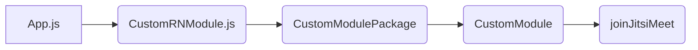

# React Native Psychiatrists Contact using JitsiMeet!

Project ini di buat dengan **JitsiMeet SDK Android** dengan menghubungkan dengan react native melalui **Bridge React Native** dengan custom module untuk mengakses JitsiMeet dan launch meeting dengan input room yang diinginkan.

## Scope Aplikasi Mobile I Health Meet Contact Asia

Project ini mempunyai fitur daftar Dokter Psikiater berserta informasi kontak, lalu adanya fitur konferensi daring dengan dokter terpilih jika sudah membuat janji sebelumnya.

## Integrasi Native SDK JitsiMeet dengan React Native

- Proses pembuatan custom module dimulai dengan membuat class CustomModule extend ReactContextBaseJavaModule yang berisi konstruksi yang butuhkan seperti reactContext juga method joinJitsiMeet yang berisi menerima ReadableMap options yang nanti berfungsi untuk menerima paramater dari JS React Native. 

- CustomModulePackage implements ReactPackage, di sini kita memambahkan file CustomModule agar di tambahkan CustomModulePackage ini.

- MainApplication pada class ini kita perlu menambah CustomModulePackage kedalam List ReactPackage agar terdaftar menjadi package di React Native.

- CustomRNModule file js yang dibuat di sisi React Native berfungsi untuk  mendeklarasikan native module yang telah kita buat.

- App.JS kita import file CustomRNModule.js ini dan lalu kita panggil method yang kita butuhkan dengan parameter yang sudah kita buat sebelumnya.

Gambaran proses React Native bridge ke Method Native Module :

